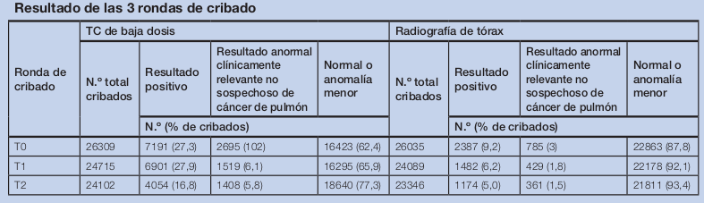

```{r setup, include=FALSE}
knitr::opts_chunk$set(echo = TRUE)
knitr::opts_chunk$set(comment = NA)
```


# Antecedentes:

El cáncer de pulmón es un importante problema sanitario. En los países desarrollados es el cáncer con mayor incidencia y mortalidad en varones, mientras que en mujeres es el tercero más frecuente y el segundo en términos de mortalidad. En 2012, fue responsable del 13% de todos los casos de cáncer y del 19,4% de todas las muertes por cáncer. Entre los múltiples factores de riesgo de la enfermedad destaca el consumo del tabaco, responsable del 85-90% de los casos y del 70% de las muertes mundiales. El consumo de tabaco provoca 9 de cada 10 casos de cáncer de pulmón en hombres y 8 de cada 10 casos en mujeres. El riesgo de que el tabaquismo produzca cáncer de pulmón aumenta con el número de cigarrillos fumados al día y el número de años durante los que se fumó, por ello, la población fumadora importante es susceptible de diagnóstico precoz.

Según la encuesta Nacional de Salud 2011-2012, el 24% de la población española de más de 15 años se declara fumador diario, de los que el 36% consume entre 10 y 20 cigarrillos al día. El mayor consumo, ≥20 cigarrillos/ día, se produce especialmente entre los 55-64 años, representando el 46% del total. El 19,6% de la población se declara exfumador, con menos de 10 años de abstinencia el 48,5% (4).
El diagnóstico tardío de la enfermedad, en el que los pacientes presentan ya metástasis a distancia disminuye significativamente la supervivencia de los pacientes. Mientras que la cirugía radical es el tratamiento más efectivo actualmente en estadios tempranos del cáncer de pulmón, el tiempo de supervivencia disminuye a medida que la enfermedad progresa, pasando del 50% del estadio IA al 43%, 36%, 25%, 19%, 7% y 2% en los estadios IB, IIA, IIB, IIIA, IIIB y IV, respectivamente. 
Ante esto surge la disposición de una prueba de cribado que detecte la enfermedad en una fase temprana para facilitar el tratamiento precoz con lo que mejoraría la supervivencia al evitar la diseminación de la enfermedad.

# Contexto

## Factores de riesgo

El principal factor de riesgo del cáncer de pulmón es el tabaco, siendo el responsable del 85% de los casos. Además, figura entre los cinco factores de riesgo principales causantes de las enfermedades crónicas de los adultos, entre ellas el cáncer, en 2010. Supone un 6,3% de AVAD mundiales (8,4% en hombres, en los que es el factor principal y 3,7% en mujeres en el que representa el cuarto factor de riesgo de enfermedad. El porcentaje del total de AVPP por cáncer de pulmón a causa del tabaco representa el 84% en España en ambos sexos (hombres 90% y mujeres 40%, datos del 2010) similares a los datos para Europa occidental (salvo en mujeres que en la última el porcentaje es 70%) y por encima de las proporciones mundiales (ambos sexos 63%, hombres 67%, mujeres 49%).
Un factor de riesgo de especial importancia es la exposición ocupacional. La Agencia Internacional para la Investigación en Cáncer (IARC), dependiente de la OMS, estimó que el 10% de las muertes por cáncer de pulmón entre los hombres y el 5% en las mujeres en el mundo se podrían atribuir a la exposición a 8 carcinógenos ocupacionales pulmonares, los asbestos, el arsénico, el berilio, el cadmio, el cromo, el níquel, los silicatos y el diésel. Destacan los asbestos, cuyo papel como carcinógeno directo o a través del aumento de riesgo tras la fibrosis pulmonar que pueden desencadenar está todavía a debate.

## Principios y consideraciones éticas de las pruebas de cribado. Requisitos de un programa de cribado
Según se recoge en el Documento Marco del Ministerio sobre Cribado Poblacional, el cribado puede llegar a reducir el impacto de una determinada enfermedad en la población, sin embargo, no siempre la detección precoz produce los beneficios esperados y tampoco está exenta de riesgos. Existe un claro requerimiento ético de que el beneficio debe superar los potenciales riesgos físicos y/o psicológicos derivados de la prueba, del proceso diagnóstico y del tratamiento.

El beneficio del cribado se obtiene mediante un diagnóstico precoz preciso, que permita realizar una intervención adecuada y mejorar el pronóstico en gran parte de los pacientes detectados. Este beneficio se debe cuantificar no solo en términos relativos de reducción del riesgo, sino también en cifras absolutas que permitan conocer el verdadero impacto de la intervención en la carga de la enfermedad en la población diana. Entre los riesgos asociados al cribado se incluye un periodo de mayor morbilidad debido al adelanto diagnóstico en aquellos pacientes en los que la detección precoz no habría supuesto una mejora de su pronóstico

A continuación, se indican los principios básicos de la ética médica y su relación con alguno de los riesgos asociados al cribado: 

    ◦ Principio de beneficencia: solo una parte de la población sometida al cribado va a padecer la enfermedad objeto de estudio, por tanto, se va a beneficiar de la intervención.

    ◦ Principio de no maleficencia: los participantes con resultados falsos positivos podrían sufrir un periodo innecesario de ansiedad o de daño psicológico, los efectos secundarios de las pruebas confirmatorias y/o un tratamiento innecesario, y entre los que obtuviesen resultados falsos negativos podrían producirse muertes evitables por retrasos diagnósticos y posterior intervención. 
    
    ◦ Principio de justicia: existe riesgo de aumentar las desigualdades si no hay equidad en el acceso o se realiza el cribado en detrimento de la implantación de otras medidas preventivas más coste-efectivas. 

    ◦ Principio de autonomía: los individuos pueden no comprender todas las implicaciones de su participación en el programa debido a la dificultad en la comunicación de los riesgos

# Estrategias de cribado para cáncer de pulmón

Una prueba de cribado de cáncer de pulmón debería detectar casos de cáncer en estadios más tempranos, en el que el tratamiento es más efectivo para modificar la historia natural del cáncer y reducir la mortalidad de la población cribada. El cribado con TCBD (Tomografía computarizada de baja dosis) se situaría a nivel de prevención secundaria, como detección precoz al ser una prueba no invasiva.
La aparición de la tomografía computarizada de baja dosis (TCBD) y su mayor sensibilidad a la hora de detectar estadios más tempranos de cáncer de pulmón mejoro el interés del cribado del cáncer de pulmón.


# Pasos generales del análisis:

## Planteamiento del problema:

Los primeros ensayos clínicos aleatorizados (ECA) realizados evaluaron pruebas como la radiografía de tórax y la citología del esputo, encontrando que, aunque detectaran casos en estadio temprano, no disminuían el número de cánceres de estadios avanzados detectados o la mortalidad debida al cáncer de pulmón. En 2004, se declaró que la evidencia acerca de la efectividad de estas pruebas de cribado del cáncer del pulmón era insuficiente, reafirmándose esto en el 2014. En específico tanto la RxT como la citología de esputo no habían demostrado una sensibilidad y especificidad adecuadas como pruebas de cribado.
La diversidad de métodos invasivos (muestras de sangre) e incluso el RxT (radiografía de torax) para poder predecir de manera precoz el cáncer de pulmón, vienen siendo opciones muy poco utilizadas por su carácter ético y por su dificultad en análisis, antes esto se busca la posibilidad de sustituir estos métodos invasivos por alguno no invasivo gracias a la computarización.

## Objetivo:

- Conocer la eficacia del cribado del cáncer de pulmón mediante tomografía computarizada de dosis baja de radiación a la hora de reducir la mortalidad por cáncer de pulmón en pacientes fumadores o ex-fumadores. 

- Conocer los efectos adversos derivados del cribado y de las pruebas diagnósticas necesarias tras un resultado falso positivo. 

- Estimar la validez de la prueba de cribado mediante la evaluación de la sensibilidad y especificidad, así como los valores predictivos y proporciones de falsos positivos y negativos

## Metodología 

### Recolección de Datos

Para el análisis de este estudio se recopilo: 

        ◦ Bases de datos de informes de evaluación de tecnologías sanitarias y revisiones sistemáticas
        
            ▪ Centre for Reviews and Dissemination (CRD) Databases (Health Technology Assessment, HTA; Database of Abstracts of Reviews of Effectiveness, DARE: http://www.york.ac.uk/inst/crd/welcome.htm
            ▪ Cochrane Library Plus: http://www.bibliotecacochrane.com/ 

        ◦ Bases de datos generales 
        
            ▪ MEDLINE (PubMed): http://www.ncbi.nlm.nih.gov 
            ▪ EMBASE (Ovid): http://www.elsevier.com/online-tools/embase
            ▪ ISI Web of Science: http://www.accesowok.fecyt.es/
            ▪ Scopus (SciVerse): http://www.scopus.com 

        ◦ Ensayos clínicos
        
            ▪ ICTRP OMS: http://www.who.int/ictrp/en/ 
            ▪ Instituto Nacional de Salud de U.S.: http://clinicatrials.gov 
            
El límite temporal de la búsqueda abarcó desde enero de 2000 hasta junio de 2015, actualizándose periódicamente hasta noviembre de 2015.

### Variables del resultado a analizar

#### Sensibilidad 

Capacidad de una prueba de cribado para detectar la enfermedad (probabilidad de que para un sujeto enfermo se obtenga un resultado positivo).

#### Especificidad 

Capacidad de una prueba de cribado para clasificar correctamente a una persona sana (probabilidad de que para un sujeto sano se obtenga un resultado negativo) 

#### Proporción de falsos positivos 

Porcentaje de falsos positivos sobre el total de cribados realizados. Se define un falso positivo como aquella prueba con resultado positivo sin confirmación diagnóstica de cáncer. 

#### Valor predictivo positivo 

Probabilidad de que un individuo con un resultado positivo en la prueba de cribado tenga la enfermedad. 

#### Valor predictivo negativo 

Probabilidad de que un individuo con un resultado negativo en la prueba no tenga la enfermedad. 

#### Proporción de estadios tempranos de cáncer de pulmón 

Porcentaje de cánceres en estadios tempranos (I-II) detectados del total de cánceres, en ronda basal y rondas de incidencia. 

#### Proporción de estadios avanzados de cáncer de pulmón 

Porcentaje de cánceres en estadios avanzados (III-IV) detectados del total de cánceres, en ronda basal y rondas de incidencia

### Muestra

Para fines prácticos del curso se tomará la información proporcionada por las tablas de comparación de cribado anual con TCBD frente a cribado con radiografía de tórax.

**esESPECIFICAR QUE SOLO ES DEL NLST**

### Diseño del estudio

Para fines prácticos del curso, este análisis se centrará en las variables antes ya mencionadas. Para se extraerá la siguiente tabla del análisis de la cual elaboraremos la respectiva tabla de contingencia comparando TC con Rx, y desarrollando y analizando cada variable con el software estadístico R.



## Analisis en R

### TOMOGRAFIA

#### data 

```{r,echo=FALSE, message=FALSE, warning=FALSE}
data = rbind(
  c(649,17497),
  c(44,56936)
)
datos = data
datos = as.table(datos)
rownames(data) = c("Prueba Cribado si", "Prueba Cribado no")
colnames(data) = c("Cancer si", "Cancer no")
data
```

####  metricas

```{r,echo=FALSE, message=FALSE, warning=FALSE}

library(caret)
caret::confusionMatrix(data = datos)
```

### RADIOGRAFIA

#### data

```{r,echo=FALSE, message=FALSE, warning=FALSE}
data = rbind(
  c(279,4764),
  c(147,68290)
)
datos = data
datos = as.table(datos)
rownames(data) = c("Prueba Cribado si", "Prueba Cribado no")
colnames(data) = c("Cancer si", "Cancer no")
data
```

####  metricas

```{r,echo=FALSE, message=FALSE, warning=FALSE}

library(caret)
caret::confusionMatrix(data = datos)
```

# Conclusiones`

aca comparar ambas prubeas y decir que la de tomografia es mejor.


